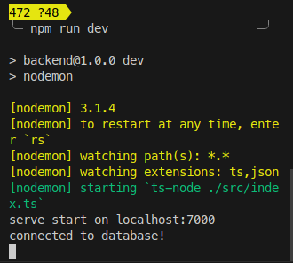

# J40-Tray

## Description
**J40 Food Tray** is a web application designed to streamline food ordering at restaurants. It allows guests to view the menu, check available food items, and place orders directly from their devices.


## Table of Contents

1. [Description](#description)
2. [Prerequisites](#prerequisites)
3. [Features](#features)
4. [Installation](#installation)
5. [Configuration](#configuration)
6. [Usage](#usage)
7. [Contributing](#contributing)


## Prerequisites
Before you begin, ensure you have met the following requirements:
Node.js(version)
npm(version)
express(version)
MongoDB
Auth0 account

## Features
- **Menu Display**: Guests can browse a comprehensive list of available food items, including detailed descriptions and images.
- **Real-Time Updates**: The app displays current availability, ensuring that guests see only what is in stock.
- **Order Placement**: Users can select items, specify quantities, and place their orders for pickup, delivery, or eat-in.
- **Admin Interface**: Restaurant staff can update the menu and manage food availability in real time.
- **Order Management**: Guests receive confirmation of their orders, and staff can track and manage incoming orders efficiently.
**J40-Tray** aims to improve the dining experience by reducing wait times, helping customers make informed choices, and providing an efficient system for managing orders.

## Installation

1. Clone the Repository
```bash
mkdir j40-tray ; cd j40-tray
git clone https://github.com/NueloSE/j40-tray-backend.git
git clone https://github.com/NueloSE/j40-tray-frontend.git

```
2. Install Dependencies

```bash
npm install
```

## Configuration

1. Set Up Environment Variables
Copy the .env.example file to a new file named .env:

```bash
cp .env.example .env
```

Open the `.env` file and replace the placeholder values with your actual environment variables. Make sure to include all necessary variables required by the application.

Example `.env` file:

```plaintext
# Auth0 Configuration
VITE_AUTH0_DOMAIN=your-auth0-domain
VITE_AUTH0_CLIENT_ID=your-auth0-client-id
VITE_AUTH0_CALLBACK_URL=your-auth0-callback-url
VITE_AUTH0_AUDIENCE=your-auth0-audience

# MongoDB Configuration
MONGODB_CONNECTION_STRING=your-mongodb-connection-string
```

2. Database Setup
Ensure that your database is up and running by changing to the backend directory ` cd j40-tray-backend `  and run `npm run dev `.
you should see the following output:


## Usage
1. Start the Application cd into the frontend folder and run the following command on terminal
`npm run dev`

This command starts the application on http://localhost:5173/


## Contributing
Contributions are welcome! If you have suggestions, bug reports, or enhancements, please follow these steps:

1. Fork the Repository
2. Create a New Branch for your changes
3. Commit Your Changes and write a descriptive commit message
4. Push Your Changes to your forked repository
5. Submit a Pull Request

